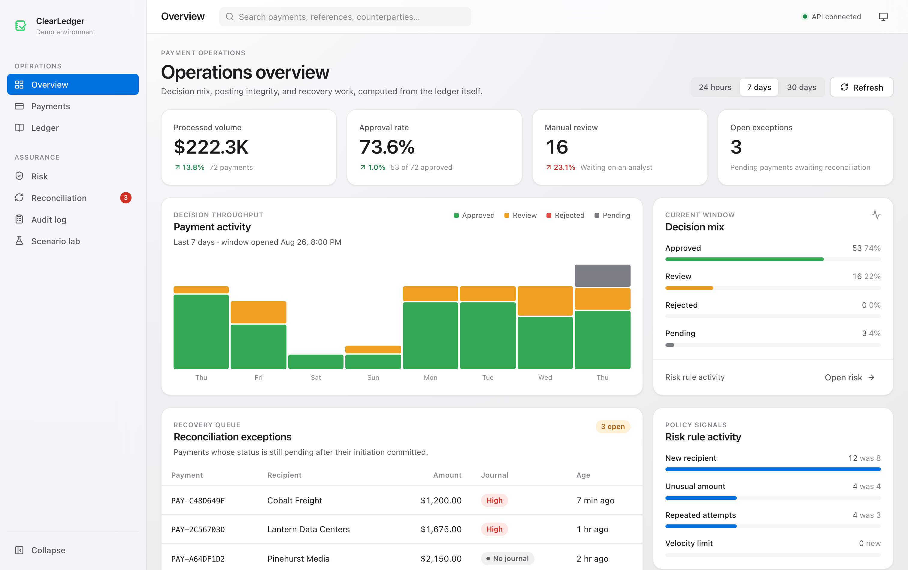
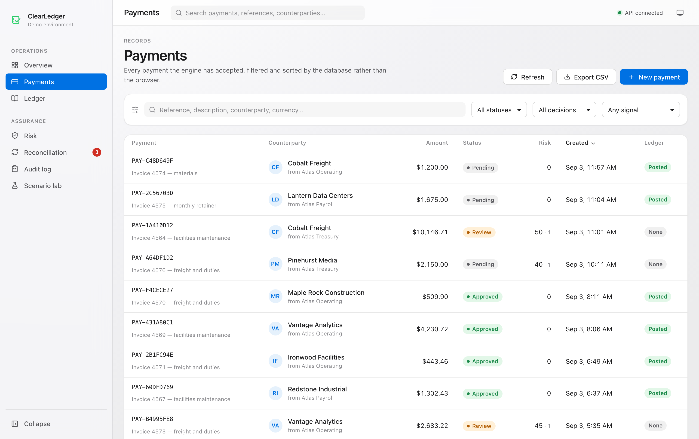
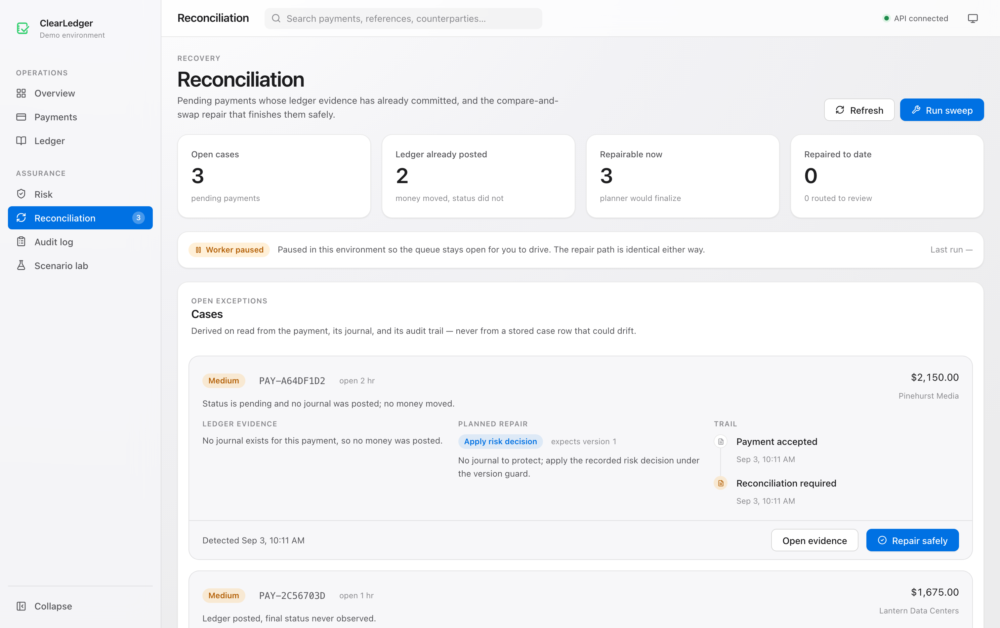
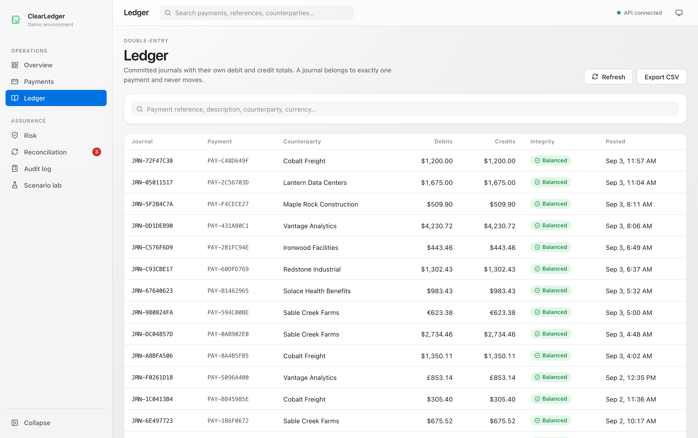
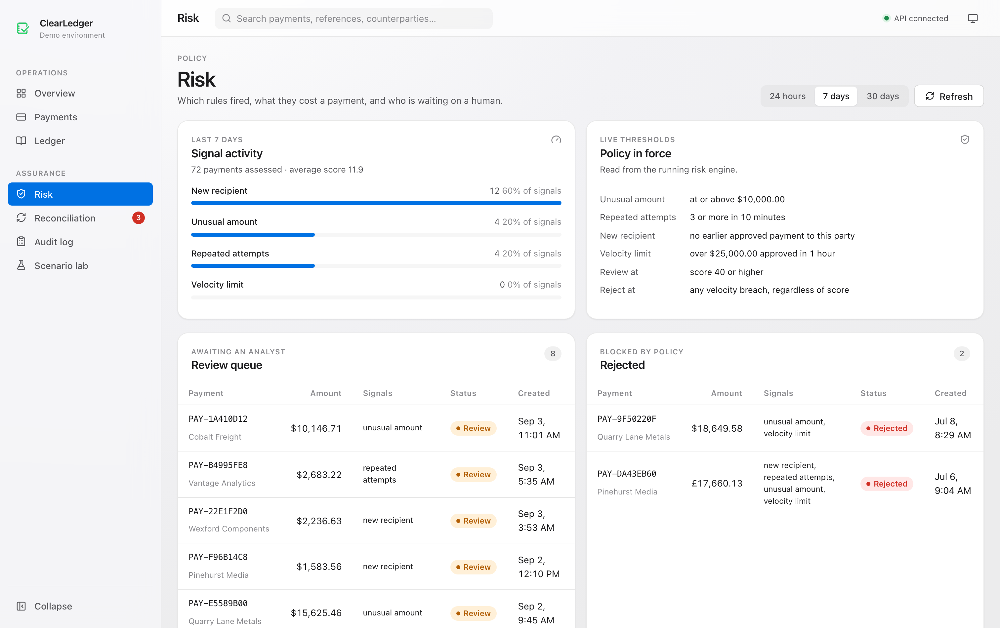
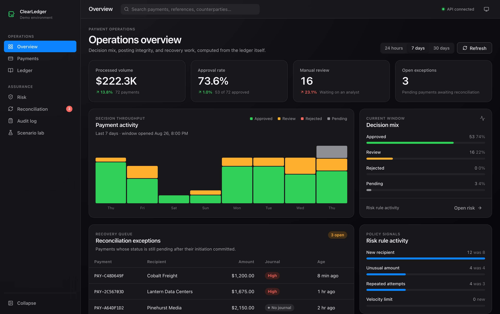
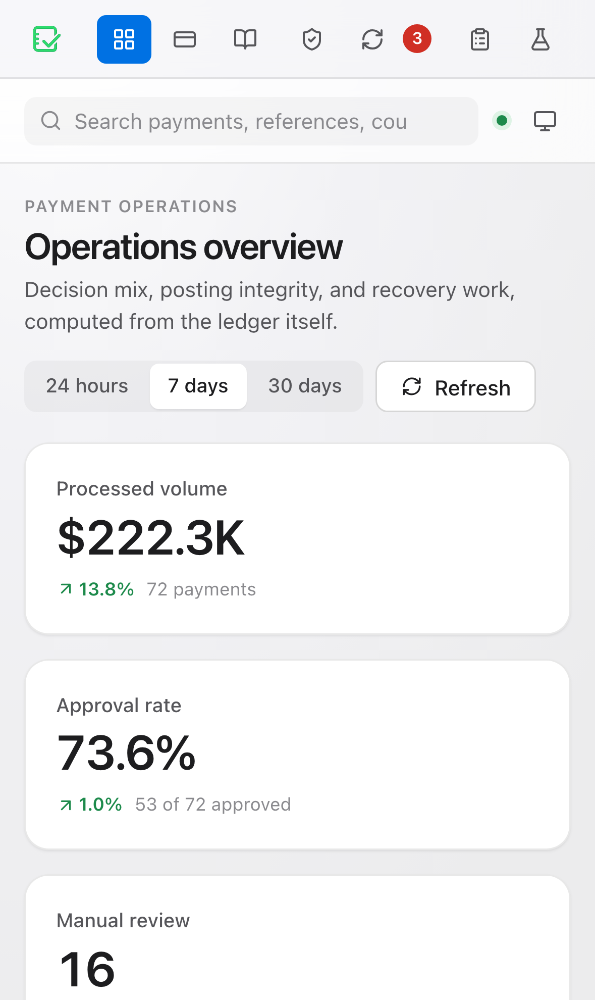

# ClearLedger

### Real-Time Payment Risk & Reconciliation Engine

ClearLedger is a working banking-systems simulation built to answer a deceptively hard
question: **how can a payment service accept retries, evaluate risk, post a balanced
ledger, and recover from a timeout without charging twice?**



It combines a Java 21 / Spring Boot API, a PostgreSQL double-entry ledger, a React
operations console, deterministic risk rules, idempotent payment creation, and a
reconciliation worker. The three built-in scenarios make its safety properties visible:

1. A normal payment is risk-assessed, journaled, and approved.
2. Two requests with the same idempotency key resolve to one payment and one journal.
3. A simulated timeout occurs **after** the balanced journal commits but **before**
   status finalization; reconciliation verifies the existing journal and
   compare-and-swap finalizes the payment without writing a second journal.

> ClearLedger uses fictional counterparties and simulated money. It is a portfolio
> system, not a bank, payment processor, or production financial product.

## Every number on screen comes from the database

The console has no fixture layer and no demo data path in the browser. Each view calls a
read-model endpoint that computes its answer from the same tables the payment path
writes, so nothing the operator sees can be more optimistic than the ledger:

| Screen | Where its figures come from |
| --- | --- |
| Overview | Payment rows bucketed by time, decision mix, and risk-signal counts, with each headline compared against the equivalent prior window |
| Payments | Server-side search, filter, sort, and paging — the footer count is the true match count, not the length of the current page |
| Ledger | Debit and credit totals summed per journal, with balance verified in SQL rather than trusted from a stored flag |
| Risk | Rule activity plus the thresholds read out of the running risk engine, so the page cannot drift from the policy in force |
| Reconciliation | Cases derived on read from the payment, its journal, and its audit trail — there is no stored "case" row that could go stale |
| Audit log | The append-only event table, with no write path on the page at all |

Seed data is generated through the real domain objects — the same risk engine, the same
`PaymentEntity.pending` factory, the same balanced two-line journals — with the clock
moved back for each record. The charts therefore show data the engine would actually have
produced.

## Operations console

- **Overview** tracks payment throughput, decision mix, risk-rule activity, ledger
  integrity, and the reconciliation queue.
- **Payments** provides global search, filters, sorting, pagination, CSV export, payment
  creation through the public API, and a record-specific risk / ledger / audit drawer.
- **Ledger, Risk, Reconciliation, and Audit log** expose focused workbenches for tracing
  journals, reviewing policy signals, safely repairing drift, and inspecting events.
- **Scenario lab** runs the three safety demonstrations against the live API.

The interface follows Apple's platform conventions — a translucent sidebar and toolbar,
one accent colour, semantic colour reserved for state, tabular figures that do not shift
as values update — and ships light, dark, and follow-the-system appearances.

| Payment operations | Safe reconciliation |
| --- | --- |
|  |  |

| Double-entry ledger | Risk policy |
| --- | --- |
|  |  |

Appearance follows the operating system, or an explicit choice that survives a reload:



The layout is responsive down to a phone-sized operations view:



## What it demonstrates

- Java 21, Spring Boot 4.1, virtual threads, validation, JPA, and Flyway
- PostgreSQL constraints and balanced double-entry journal semantics
- A separate read model for the console, so screen queries cannot destabilise the
  transactional contract other systems integrate against
- REST APIs with idempotency-key conflict detection and safe concurrent retries
- Explainable risk signals: unusual amount, repeated attempts, new recipient, velocity
- Scheduled **and** operator-triggered reconciliation, both through one compare-and-swap
  repair path
- Structured audit events, health probes, and operationally useful failure states
- React 19, TypeScript, Vite, Vitest, and Playwright against a live stack
- Multi-stage, non-root containers; Docker Compose; GitHub Actions; CodeQL; GHCR

## Run the full application

Requirements: Docker Engine with Compose v2 and at least 4 GB available memory.

```bash
cp .env.example .env
# Replace the sample POSTGRES_PASSWORD in .env before starting.
docker compose up --build --wait
```

Open [http://localhost:8088](http://localhost:8088). Compose binds the demo to the local
loopback interface only. The browser only talks to nginx; nginx serves the static app and
proxies `/api/*` to the internal API. PostgreSQL is not published to the host.

On first start the API seeds two months of payment history so the console opens with
something to read. Stop the stack while preserving its database:

```bash
docker compose down
```

Remove the local demo database as well:

```bash
docker compose down --volumes
```

### Without Docker

The `local` Maven profile starts a real PostgreSQL 17 inside the JVM, so the whole API
runs with no daemon, no container, and no installed database:

```bash
./mvnw -Plocal spring-boot:run -Dspring-boot.run.profiles=local,demo
```

Then, in a second terminal:

```bash
npm --prefix frontend ci && npm --prefix frontend run dev
```

The console is on [http://localhost:4173](http://localhost:4173) and proxies `/api` to
the API on port 8080. ClearLedger depends on PostgreSQL semantics that no in-memory
substitute provides — `FOR UPDATE SKIP LOCKED`, `ON CONFLICT`, regex check constraints —
so this path runs the genuine article rather than something that behaves differently from
production. The dependency is compiled only under `-Plocal` and never reaches the
published image.

## Demo the safety story

Open **Scenario lab** from the console navigation, then use it in this order:

| Scenario | What to watch |
| --- | --- |
| Normal | Risk decision becomes approved, a debit and credit balance, status is final |
| Duplicate | Both attempts resolve to the same payment; payment and journal counts stay at one |
| Timeout | Journal is balanced while status remains pending; reconciliation CAS-finalizes it |

After running the timeout scenario, open **Reconciliation**. The case shows the committed
journal, the action the planner would take, and the version the repair expects. Repairing
it reports the version transition it committed — and the ledger's journal count does not
change, because a repair verifies rather than re-posts.

The reconciliation worker is paused in the demo profile on purpose: its job is to heal
every pending payment within one interval, which would empty the queue seconds after
startup. The console shows the worker's state rather than hiding it, and the manual
repair path is byte-for-byte the one the worker uses.

For a concise interviewer walkthrough, expected observations, and API commands, use
[the five-minute demo script](docs/demo-script.md).

## API at a glance

All money is represented as integer minor units: `25000` means USD 250.00. Mutation
requests use JSON and payment creation requires an `Idempotency-Key` header.

### Transactional contract

| Method | Endpoint | Purpose |
| --- | --- | --- |
| `POST` | `/api/v1/payments` | Validate, deduplicate, assess risk, and create a payment |
| `GET` | `/api/v1/payments` | List payments, optionally filtered by status |
| `GET` | `/api/v1/payments/{paymentId}` | Read payment state and risk evidence |
| `POST` | `/api/v1/reconciliation/runs` | Run reconciliation with `X-ClearLedger-Request` |
| `POST` | `/api/v1/demo/scenarios/{normal\|duplicate\|timeout}` | Run a safety demonstration |
| `GET` | `/actuator/health/readiness` | API readiness probe (internal in Compose) |

### Console read model

These endpoints answer a screen's questions and are free to change with the UI; the
contract above is the one to integrate against.

| Method | Endpoint | Purpose |
| --- | --- | --- |
| `GET` | `/api/v1/console/overview?range=24h\|7d\|30d` | Headline metrics with prior-window comparison, throughput buckets, decision mix, signal activity, ledger health |
| `GET` | `/api/v1/console/payments` | Search, filter, sort, and page payments with counterparty names resolved |
| `GET` | `/api/v1/console/payments/{paymentId}` | Every rule evaluated, the journal, and the audit trail |
| `GET` | `/api/v1/console/journals` | Journals with debit and credit totals and verification results |
| `GET` | `/api/v1/console/audit-events` | The append-only log, filterable by type |
| `GET` | `/api/v1/console/risk?range=` | Rule activity plus the engine's live thresholds |
| `GET` | `/api/v1/console/reconciliation` | Open cases, planner intent, run history, worker state |
| `POST` | `/api/v1/console/reconciliation/cases/{paymentId}/repair` | Repair one case under the version guard |
| `GET` | `/api/v1/console/counterparties?role=` | Named senders and recipients |

Example payment:

```bash
curl --fail-with-body http://localhost:8088/api/v1/payments \
  -X POST \
  -H "Content-Type: application/json" \
  -H "Idempotency-Key: demo-payment-001" \
  -d '{
    "senderId": "10000000-0000-0000-0000-000000000001",
    "recipientId": "20000000-0000-0000-0000-000000000001",
    "amountMinor": 25000,
    "currency": "USD",
    "description": "Invoice CL-1001"
  }'
```

Repeat the command unchanged to receive the original payment outcome. Reusing the same
key with a different amount is rejected as an idempotency conflict.

## Safety invariants

The implementation is intentionally conservative:

- A sender and hashed idempotency key identify at most one payment.
- An idempotency key is never persisted in plaintext.
- The same key with a different request fingerprint is a conflict, not a replay.
- A journal belongs to exactly one payment.
- Every journal contains equal debit and credit totals in one currency.
- Status moves only through explicit state-machine transitions.
- Reconciliation never "tries the payment again." It verifies the committed journal,
  then updates the still-pending row only if its expected version still matches.
- A stale worker loses the compare-and-swap and cannot overwrite newer state.
- An operator repair and the background worker share one implementation, so the console
  cannot acquire weaker guarantees than the scheduler.

See [Architecture](docs/architecture.md) for component boundaries, schema decisions,
failure handling, and the editable [system diagram](docs/architecture.svg).

## Local development

### API

Either use the no-Docker path above, or start only PostgreSQL:

```bash
cp .env.example .env
docker compose up -d postgres
```

The database is intentionally isolated inside Compose, so for host-based API development
either publish a development-only PostgreSQL port override or use a local PostgreSQL 17
instance. Then:

```bash
./mvnw spring-boot:run
./mvnw verify
```

`verify` runs unit tests, PostgreSQL Testcontainers integration tests, and an 80% line
coverage gate. Integration tests skip automatically when no Docker daemon is present.

Configuration uses environment variables. Notable values are:

| Variable | Meaning | Compose default |
| --- | --- | --- |
| `SPRING_DATASOURCE_URL` | JDBC connection URL | internal `postgres:5432` |
| `SPRING_DATASOURCE_USERNAME` | database role | value from `.env` |
| `SPRING_DATASOURCE_PASSWORD` | required database secret | value from `.env` |
| `CLEARLEDGER_RECONCILIATION_ENABLED` | run the background worker | `false` under `demo` |
| `CLEARLEDGER_RECONCILIATION_FIXED_DELAY_MS` | reconciliation interval | `30000` |
| `CLEARLEDGER_DEMO_SEED_HISTORY` | seed two months of history on an empty database | `true` under `demo` |
| `CORS_ALLOWED_ORIGINS` | allowlisted local origins | localhost dev ports |

The Compose stack activates the `demo` profile so the browser can run the three portfolio
scenarios without credentials. The default non-demo profile uses HTTP Basic authentication
and restricts reconciliation, console repair, and operational metrics to the `OPS` role.

### Web

```bash
cd frontend
npm ci
npm run dev
```

Useful quality gates:

```bash
npm run verify
npm run e2e
```

The production web container sets `VITE_API_BASE_URL=/api/v1` and uses a same-origin
nginx proxy. No API secret is compiled into the browser bundle.

## Repository map

```text
src/main/java/            payment, risk, ledger, reconciliation, counterparty, console read model
src/main/resources/       configuration and Flyway migrations
src/local/java/           in-process PostgreSQL for the "local" Maven profile only
src/test/                 unit and PostgreSQL Testcontainers integration tests
frontend/src/design/      design tokens, primitives, and shell styling
frontend/src/lib/         typed API client, formatting, CSV export
frontend/src/pages/       one workbench per operator task
docs/                     architecture, demo runbook, and application screenshots
.github/workflows/        CI, security analysis, dependency review, releases
Dockerfile.api            layered non-root JVM image
Dockerfile.web            static frontend image with nginx reverse proxy
compose.yml               PostgreSQL + API + web topology
```

## CI and releases

Pull requests run Java verification against PostgreSQL/Testcontainers, frontend lint /
test / build with coverage thresholds, two container builds, Playwright scenarios against
the composed stack, dependency review, and CodeQL analysis. Weekly Dependabot groups
routine Maven, npm, Docker, and Actions updates.

Pushing a semantic version tag such as `v1.0.0` publishes multi-architecture images:

```text
ghcr.io/<owner>/<repository>-api:1.0.0
ghcr.io/<owner>/<repository>-web:1.0.0
```

Published images include GitHub build-provenance attestations.

## Security and license

Read [SECURITY.md](SECURITY.md) before deploying or reporting a vulnerability.
ClearLedger is available under the [MIT License](LICENSE).
