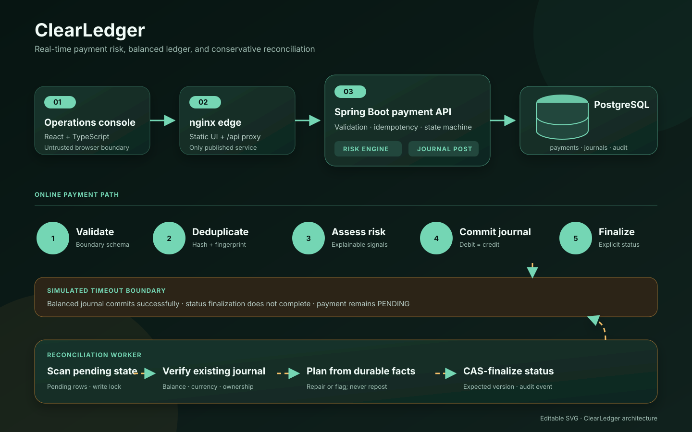

# ClearLedger Architecture

## Design objective

ClearLedger demonstrates the correctness boundary in a payment system: an ambiguous
client or downstream timeout must not produce an ambiguous ledger. Its design favors
explicit invariants, durable evidence, and replay-safe recovery over optimistic retry.

The editable overview is available as
[architecture.svg](architecture.svg).



## Runtime topology

| Component | Responsibility | Trust boundary |
| --- | --- | --- |
| React operations console | Run scenarios and inspect payments, risk evidence, journals, and reconciliation | Untrusted browser input |
| nginx edge | Serve static assets, apply browser security headers, same-origin proxy `/api/*` | Only host-published service |
| Spring Boot API | Validate requests, enforce idempotency, calculate risk, post journals, expose status | Application boundary |
| Reconciliation worker | Scan stale pending payments, verify durable facts, plan and CAS-apply repairs | Same API process, separate scheduled workload |
| PostgreSQL | Source of truth for payments, journals, audit events, locks, and recipient history | Internal-only Compose network |

The web and API containers share the `edge` network. The API and PostgreSQL share the
internal `data` network. The database has no host port in the default Compose file.

## Payment path

1. The API validates the UUIDs, positive `amountMinor`, ISO-style uppercase currency,
   bounded description, and required idempotency header.
2. A SHA-256 request fingerprint is derived from the normalized payment fields. The raw
   idempotency key is hashed before persistence.
3. The sender-scoped idempotency constraint is checked:
   - same key hash + same fingerprint returns the existing payment;
   - same key hash + different fingerprint returns a conflict;
   - no match continues processing.
4. The risk engine evaluates durable sender history and the current request.
5. The payment is inserted as `PENDING`, with risk decision, score, and signal evidence.
6. For an approved risk decision, a journal and its debit/credit entries commit
   atomically with the still-pending payment. Review/rejected decisions do not post money.
7. A separate finalization transaction moves the state to `APPROVED`, `REVIEW`, or
   `REJECTED`.
8. Audit events record meaningful transitions without logging the raw idempotency key.

Database uniqueness is the last line of defense for concurrent duplicate requests. It
does not rely on two application threads observing state in a particular order.

## Risk rules

The rules are intentionally deterministic and explainable:

| Signal | Trigger | Effect |
| --- | --- | --- |
| Unusual amount | amount ≥ 1,000,000 minor units | +50, review |
| Repeated attempts | at least 3 distinct recent attempts | +45, review |
| New recipient | no earlier approved relationship | +40, review |
| Velocity limit | new payment would exceed 2,500,000 recent minor units | +100, reject |

Velocity is a hard rejection. Otherwise a total score of 40 or more routes the payment
to review; lower scores approve. Idempotent replays are not new attempts and therefore
must not inflate velocity or repeated-attempt evidence.

## Ledger model

```text
payments 1 ─── 0..1 journals 1 ─── 2..n journal_entries
    │
    └── 0..n audit_events
```

The important database constraints are:

- `payments(sender_id, idempotency_key_hash)` is unique;
- `journals.payment_id` is unique;
- monetary amounts are positive integers;
- currency and status values are constrained;
- journal lines have an explicit `DEBIT` or `CREDIT` direction;
- entities use UUID identifiers and UTC timestamps;
- payment `version` supports optimistic compare-and-swap.

Application verification additionally requires equal debit and credit totals, the same
currency as the payment, expected clearing/customer accounts, and exactly one journal
for a finalized payment.

## Conservative timeout and reconciliation model

The timeout scenario is deliberately placed at the most instructive boundary:

```text
balanced journal COMMIT succeeds
             ↓
status finalization times out
             ↓
payment remains PENDING, journal remains durable
```

This is not a partial double-entry write. Both journal sides are already committed. The
incomplete state is the projection/status around that durable financial fact.

Reconciliation proceeds as follows:

1. Select `PENDING` payments under a database write lock.
2. Load the payment, risk outcome, journal, journal entries, and current version.
3. Verify that one journal exists and that its lines balance in the payment currency.
4. Ask the pure reconciliation planner for an action:

| Durable facts | Plan |
| --- | --- |
| Approved decision + balanced matching journal | Finalize `APPROVED` |
| Approved decision + missing journal | Flag `REVIEW`; do not invent a financial write |
| Review/rejected decision + no journal | Finalize the stored non-monetary decision |
| Any unexpected, unbalanced, or mismatched journal | Flag `REVIEW`; do not auto-repair |
| Already final | No action |

5. Apply a status-only entity update. JPA's `@Version` adds the observed version to the
   update predicate, while the reconciliation query's write lock serializes workers.
6. On success, write an audit event and count the repair.
7. A stale optimistic update cannot overwrite newer state; its transaction fails and
   rolls back rather than silently winning.

The repair **does not create a journal and does not invoke payment creation again**.
Consequently, a scheduled worker, an operator-triggered run, and a concurrent API
request may race without producing a second ledger write.

## Concurrency model

- Sender-level locking serializes history-dependent risk computation where required.
- PostgreSQL uniqueness guarantees one payment per sender/idempotency key.
- One journal per payment is guaranteed independently by a unique foreign key.
- Optimistic versions prevent lost updates during finalization and reconciliation.
- Java virtual threads allow request concurrency without changing transaction boundaries.

## Status state machine

```text
                 ┌────────── APPROVED
                 │
PENDING ─────────┼────────── REVIEW
                 │
                 └────────── REJECTED
```

Terminal states do not transition to another terminal state. A reconciliation repair
must use the same transition rules as the online path.

## Observability

Structured application logs should include stable technical identifiers (`paymentId`,
`runId`, outcome, duration, repair count) and never raw idempotency keys or sensitive
payloads. Spring Boot readiness/liveness endpoints drive Compose health checks. Audit
events preserve business-relevant decisions separately from diagnostic logs.

Recommended production extensions are metrics for:

- payments by final decision and risk signal;
- idempotent replays and conflicts;
- pending-payment age;
- reconciliation scanned, repaired, flagged, and CAS-lost counts;
- journal verification failures;
- API latency and error rate.

## Security posture

Inputs are validated at the API boundary, JPA/Flyway avoid dynamic SQL concatenation,
errors omit stack traces, database credentials enter through environment variables, and
containers run without root privileges. The nginx container denies external actuator
access and applies a restrictive content security policy.

This demo intentionally does not claim production authentication, authorization,
regulatory compliance, or real payment-network integration. See
[SECURITY.md](../SECURITY.md) for deployment gaps and responsible disclosure.

## Testing strategy

| Layer | Focus |
| --- | --- |
| Unit | request fingerprints, risk thresholds, state transitions, reconciliation plans |
| Integration | Flyway schema, concurrent idempotency, journal balance, timeout recovery using PostgreSQL Testcontainers |
| Web | data mapping, user actions, status/risk presentation |
| E2E | normal, duplicate, and timeout/reconciliation journeys through the composed stack |
| Delivery | Maven verify, npm lint/test/build, image builds, CodeQL, dependency review |
